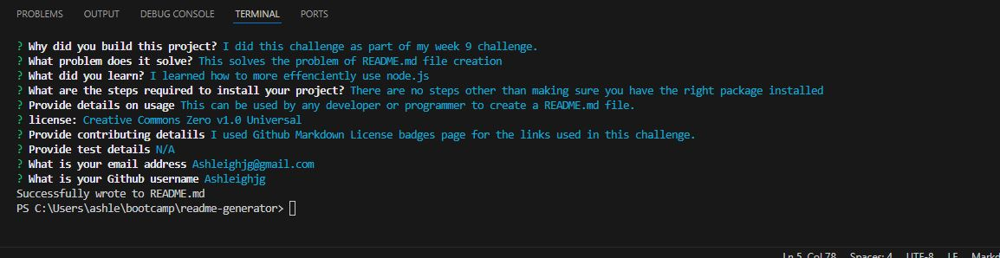
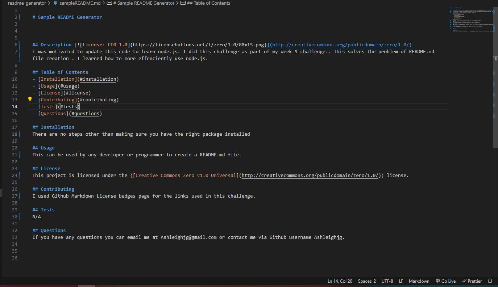
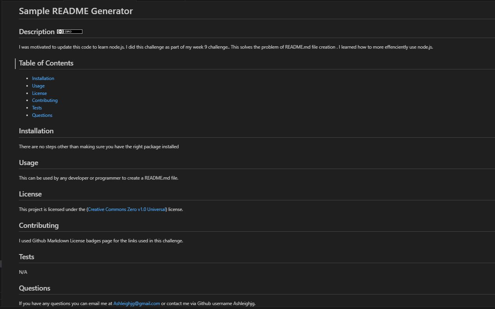

# README Generator

## Description

I was motivated to do this challenge as part of my bootcamp week9 challenge. This solves the problem of README.md file creation in a professional automated way. I learned how to more effenciently use node.js.

([Link to video walkthrough](https://drive.google.com/file/d/1w4FEhpcvK072HiEcPRELHlmGRmrGCrIw/view))

([Code source location](https://github.com/Ashleighjg/README-generator))

## Table of Contents

- [Installation](#installation)
- [Usage](#usage)
- [License](#license)
- [Contributing](#contributing)
- [Tests](#tests)
- [Questions](#questions)

## Installation

N/A

## Usage

This README generator can be used by developers and programmers to created a high quality professional README.md file.

Once the user has run "node index" in the terminal and input responses to the prompted questions, there will be a README.md file created in that folder.

## License

This project is licensed under the ([MIT](https://opensource.org/licenses/MIT)) license.

## Contributing

License/Badge links were sourced from Github Markdown License badges.

Portions of this code is sourced from Xpert Learning Assistant.

([Github Markdown License badges](https://gist.github.com/lukas-h/2a5d00690736b4c3a7ba)) and
([Xpert Learning Assistant](https://bootcampspot.instructure.com/courses/6022/external_tools/313))

## Tests

N/A

## Questions

If you have any questions you can email me at Ashleighjg@gmail.com or contact me via Github username Ashleighjg.
